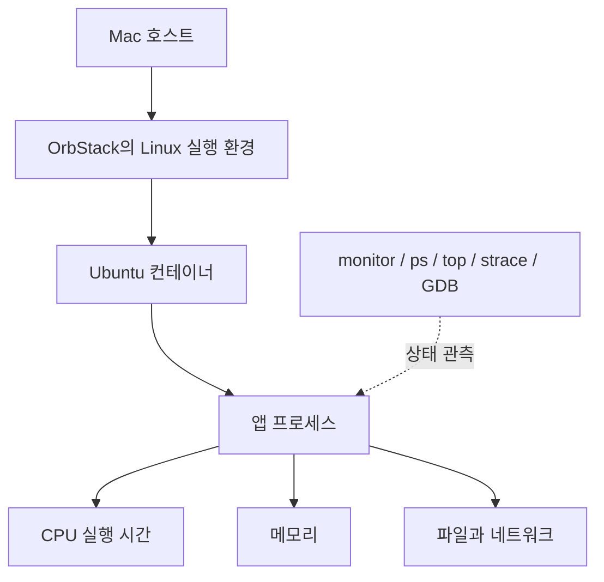

# 주니어 개발자를 위한 B1-2 학습 가이드

> **이 프로젝트의 핵심은 “프로그램이 이상하다”를 “어떤 자원에서, 무엇이 막혔고, 왜 그렇게 판단하는지”로 설명하는 것이다.**
>
> 먼저 개념과 사례를 읽고, 마지막의 로그 읽기 연습으로 직접 확인하자. 이 문서의 실험 수치는 저장소의 실제 증거에서 가져왔다. 비유와 가상 예시는 따로 표시했다.

## 1. 무슨 과제였을까?

제공된 `agent-leak-app`을 Linux에서 실행하면 설정에 따라 메모리 누적, CPU 부하 증가, 교착상태를 관측할 수 있다. 우리는 앱을 새로 만들거나 소스를 고치는 대신, **실행 중인 프로그램을 외부에서 관찰하고 장애를 분석**했다. 제공 바이너리의 디컴파일과 역공학은 과제에서 금지했다.

해야 할 일은 세 장애 각각에 대해 다음 질문에 답하는 것이었다.

1. 무엇이 이상했는가?
2. 어떤 로그와 수치가 그 판단을 뒷받침하는가?
3. 운영체제와 프로그램 안에서 어떤 일이 일어났다고 볼 수 있는가?
4. 환경변수를 바꾸자 결과가 어떻게 달라졌는가?
5. 임시로 나아진 것인가, 원인까지 해결된 것인가?

최종 산출물은 **GitHub Issue 형식의 장애 보고서 3건**이었다. 각 보고서에 현상, 증거, 원인, 조치, Before/After를 담아 PDF 또는 GitHub 저장소로 제출하는 과제다. 원문은 [requirement.md](requirement.md)에 있다.

| 사례 | 관측할 현상 | 변경해서 비교한 설정 |
| --- | --- | --- |
| 메모리 | 메모리가 늘다가 앱이 보호 종료됨 | `MEMORY_LIMIT` |
| CPU | 짧은 CPU 상승과 Watchdog 종료 | `CPU_MAX_OCCUPY` |
| 교착상태 | 프로세스는 남아 있지만 작업이 멈춤 | `MULTI_THREAD_ENABLE` |

이후 평가 보완으로 교착상태의 **실제 콜스택·시스템 호출 증거**와 **동시 장애 대응 절차**를 추가했다. 작업 로그에서 스케줄링 패턴을 추론하는 내용은 선택 과제였다.

## 2. 운영체제는 이 이야기에서 무슨 일을 할까?

프로그램은 CPU, 메모리, 파일, 네트워크 같은 자원을 사용한다. 운영체제는 여러 프로그램이 이러한 자원을 사용할 수 있도록 관리한다. 지금 실행할 작업을 고르고, 메모리를 관리하며, 파일·네트워크 접근과 권한을 다룬다.

이 프로젝트의 구성은 다음과 같다.



Ubuntu 컨테이너는 Linux 커널 위에서 격리된 실행 환경을 제공한다. 컨테이너마다 별도 커널이 있는 것은 아니다. 이번에는 Mac에서 Linux용 바이너리를 실행하기 위해 OrbStack의 Linux 환경을 사용했다.

서로 다른 두 종류의 제한도 있었다.

- **앱 설정:** 예를 들어 `MEMORY_LIMIT=512`는 앱이 읽고 처리하는 설정이다.
- **컨테이너 제한:** 메모리 1GiB, CPU 실행 시간 상한 2코어 상당은 앱 바깥의 자원 제한이다.

앱 설정의 이름만 보고 OS가 그 숫자를 그대로 강제한다고 가정하면 안 된다. 앱이 설정을 어떻게 사용하는지는 실행 결과와 로그로 확인해야 한다.

### 프로그램, 프로세스, 스레드

| 개념 | 쉬운 설명 | 이 프로젝트에서의 예 |
| --- | --- | --- |
| 프로그램 | 디스크에 저장된 실행할 코드·파일 | `agent-leak-app-x86` |
| 프로세스 | 프로그램이 실행 중인 인스턴스 | PID 5782의 앱 |
| PID | 프로세스를 구분하는 번호 | `ps`에서 찾는 대상 번호 |
| 스레드 | 프로세스 안에서 일을 진행하는 실행 흐름 | Worker-1, Worker-2 |
| TID / LWP ID | Linux에서 스레드를 구분할 때 쓰는 식별자 | 추가 진단의 LWP 331, 332 |

프로세스는 자기 주소 공간을 가지며, 같은 프로세스의 스레드들은 힙 같은 자원을 공유한다. 각 스레드는 자기 호출 스택과 실행 상태를 가진다. **공유하기 때문에 협력이 가능하고, 공유하기 때문에 충돌도 생긴다.**

프로그램 하나를 실행했다고 관측할 PID가 반드시 하나인 것은 아니다. 이 앱에서는 부모 실행기와 실제 작업 자식 프로세스가 함께 있었다. 부모는 자식을 기다리며 작은 메모리를 쓰고, 자식이 실제 작업을 했다. 부모의 메모리만 보면 메모리 증가를 놓칠 수 있다.

PID는 프로세스가 끝나면 나중에 재사용될 수도 있다. 장애를 기록할 때 PID뿐 아니라 시각, 실행 파일, 부모/자식 관계를 함께 남긴 이유다.

## 3. 사례 A: 메모리가 계속 늘다가 종료되었다

### 3.1 메모리, 힙, RSS부터 구분하자

메모리는 프로그램이 작업에 필요한 데이터를 두는 공간이다. 책상 위에 자료를 펼쳐 두고 일한다고 생각하면 이해하기 쉽다. 다만 실제 메모리는 운영체제가 주소와 페이지 단위로 관리한다.

프로세스의 메모리에는 실행 코드, 데이터, 힙, 스택, 매핑된 영역 등이 있다.

- **힙(Heap):** 실행 중 만들어지는 객체나 동적으로 확보한 데이터를 저장하는 데 사용하는 영역이다.
- **스택(Stack):** 함수 호출에 필요한 실행 정보를 보관하는 영역이다. 나중에 볼 콜스택은 “어떤 함수들을 거쳐 지금 위치에 도달했는지”를 나타낸다.
- **RSS:** 프로세스의 메모리 중 현재 RAM에 상주하는 페이지의 크기다. 힙만 포함하는 값은 아니며 공유 페이지도 포함할 수 있다.

따라서 앱 로그의 `Current Heap: 100MB`와 `ps`의 RSS는 같은 측정값이 아니다. 이번 `monitor.sh`의 `RSS_KB`는 KiB 단위이고, 1MiB는 1,024KiB다. 앱 로그의 MB 표기는 앱이 출력한 이름 그대로 보존했다.

### 3.2 메모리 누수란?

더는 필요하지 않은 데이터를 프로그램이 계속 붙잡고 있어서 메모리가 회수되지 않는 문제가 대표적인 메모리 누수다. 수명이 지나도 비워지지 않는 캐시처럼, 무제한 보관이 문제를 일으키기도 한다.

다음은 **개념 설명용 코드이며 제공 바이너리의 소스가 아니다.**

```python
saved_requests = []

def remember_request(payload):
    saved_requests.append(payload)
```

요청이 올 때마다 큰 데이터를 넣고 지우지 않는다면 목록이 계속 커질 수 있다. Python처럼 가비지 컬렉션을 사용하는 언어에서도, 프로그램이 계속 참조하는 객체는 단순히 “오래됐다”는 이유로 자동 삭제되지 않는다.

하지만 **메모리 증가만으로 누수를 확정할 수는 없다.** 정상적인 캐시, 순간적인 대량 처리, 나중에 정리되는 데이터도 메모리를 증가시킨다. 증가 이후 해제되는지와 사용량이 반복적으로 안정되는지까지 살펴야 한다.

### 3.3 실제로 무엇을 관측했나?

100MB 설정에서는 약 3초마다 앱의 Heap 표시가 25MB씩 증가했다. OS 관제의 RSS도 함께 늘었다.

```text
15:48:16  RSS 18,512KiB
15:48:20  RSS 69,720KiB
15:48:25  RSS 95,324KiB
```

위는 [관제 원문](evidence/oom/before/monitor-33.log)에서 시각과 RSS만 추린 것이다. 마지막 관제 샘플 뒤에 추가 할당과 종료가 발생할 수 있으므로 이 값을 종료 순간의 최고 메모리라고 부르지는 않는다.

종료 직전 앱은 다음 메시지를 남겼다.

```text
Memory limit exceeded (100MB >= 100MB)
>>> [SYSTEM] SELF-TERMINATED (Memory Limit Exceeded) <<<
```

첫 줄은 [앱 원문](evidence/oom/before/app.log)의 핵심 메시지 부분이다. 환경변수만 바꿔 비교한 결과는 다음과 같다.

| MEMORY_LIMIT | 관측 결과 | 해석 |
| --- | --- | --- |
| 100MB | 약 11.4초 후 MemoryGuard 종료 | 낮은 한도에서 누적 중 종료 |
| 200MB | 약 23.7초 후 같은 종료 | 더 오래 버텼지만 같은 현상 재발 |
| 512MB, 추가 관측 | 약 75.1초 관측 중 자체 종료 없음. 캐시 정리 후 RSS 감소 | 이 설정에서는 정상 정리 경로를 확인 |

512MB 설정의 실행에서는 RSS가 **528,672KiB → 16,752KiB**로 내려갔고 `MEMORY RECOVERED`도 출력되었다. 그래서 이 앱을 “어떤 설정에서도 영원히 메모리를 해제하지 않는 프로그램”이라고 결론 내리지 않았다.

**이번에 직접 확인한 원인은 낮은 메모리 한도에서 데이터가 누적되다가 앱 보호 정책에 따라 종료되는 설정 의존 동작이다.** 어떤 자료구조와 내부 분기가 이를 구현하는지는 확인하지 않았다.

### 3.4 MemoryGuard와 OOM Killer는 다르다

OOM은 Out Of Memory, 즉 메모리가 부족한 상황을 뜻한다. 과제의 사례 이름은 OOM Crash지만, 누가 종료했는지를 더 구체적으로 구분해야 한다.

| 구분 | 판단·실행 주체 | 이번 실험 |
| --- | --- | --- |
| MemoryGuard | 애플리케이션의 메모리 보호 로직 | 종료 선언 로그와 실제 종료를 확인 |
| Linux OOM Killer | 메모리 부족 상황에서 동작하는 커널 메커니즘 | 이번 종료의 원인으로 볼 증거가 없었고 cgroup OOM 카운터도 0 |

메모리 누적이 계속되면 다른 프로그램이 쓸 여유가 줄고, 메모리 회수나 스왑 부담이 커질 수 있다. 하지만 이번에는 “컴퓨터 전체의 메모리가 바닥났다”가 아니라 **앱이 자체 보호 종료했다**고 설명하는 것이 증거에 맞는다.

**기억할 문장:** 한도를 높여 생존 시간이 늘어났다는 사실과, 불필요한 메모리가 해제되었다는 사실은 다르다.

자세한 수치와 근거: [메모리 보고서](reports/oom.md).

## 4. 사례 B: CPU가 순간적으로 올라가고 Watchdog가 종료했다

### 4.1 CPU 사용률은 무엇인가?

CPU는 명령을 실행한다. CPU 사용률은 정해진 관측 시간 동안 CPU를 얼마나 사용했는지를 나타낸다. 수치를 볼 때는 **어느 대상의 CPU인지, 몇 초 동안 계산한 값인지**를 함께 알아야 한다.

이번 관제는 코어 하나를 계속 사용하면 100%가 되는 기준이다. 따라서 100%가 곧 컴퓨터의 모든 코어를 사용했다는 뜻은 아니다. 여러 코어에서 실행되는 프로세스라면 이 기준의 사용률이 100%를 넘을 수도 있다.

운영체제의 **스케줄러**는 실행 가능한 작업들에 CPU 시간을 배분한다. 실행할 작업이 많아지면 어떤 작업은 자신의 차례를 더 기다리게 된다. CPU를 많이 쓰는 일이 응답 지연으로 이어질 수 있는 이유다. 다만 CPU 수치만으로 실제 요청이 몇 초 느려졌는지는 알 수 없다.

### 4.2 1초 관제로는 짧은 상승을 놓칠 수 있다

다음은 **측정 시간의 차이를 설명하기 위한 가상 예시**다.

```text
총 1초: [CPU를 가득 사용하는 50ms] [쉬는 950ms]

1초 전체 평균으로 보면: 약 5%
바쁜 50ms 구간만 보면: 약 100%
```

두 수치 모두 같은 실행을 설명할 수 있다. 평균을 낸 시간 범위가 다르기 때문이다.

이 프로젝트의 CPU Before에서는 다음 값을 얻었다.

| 지표 | 관측값 | 의미 |
| --- | --- | --- |
| 약 1초 관제 CPU 최대 | 5.0% | 비교적 긴 구간의 OS CPU 사용률 |
| 약 50ms 관제 CPU 최대 | 78.6% | 짧은 작업 구간에서 높아진 OS CPU 사용률 |
| 종료 직전 앱 Current Load | 52.69% | 앱이 출력하는 별도의 내부 지표 |

특히 **Current Load 52.69%를 OS CPU 사용률이라고 옮겨 적으면 안 된다.** 앱 지표의 계산식 전체는 확인하지 않았고, 실제 측정값과도 차이가 있었다.

### 4.3 Watchdog는 어떤 역할인가?

Watchdog는 상태를 감시하고 정해진 조건을 벗어나면 대응하는 장치나 로직을 부르는 말이다. 이 앱은 내부 부하가 정책상 허용 범위를 위반했다는 로그를 남긴 뒤 종료했다.

```text
>>> [SYSTEM] WATCHDOG: INITIATING EMERGENCY ABORT (SIGTERM) <<<
```

`CPU_MAX_OCCUPY`를 100에서 40으로 바꾸자 앱은 40.00%라는 내부 부하 값에서 **cooldown**, 즉 부하를 낮추는 단계로 전환했다.

| CPU_MAX_OCCUPY | 결과 |
| --- | --- |
| 100 | 약 30.5초 후 Watchdog가 SIGTERM 종료 |
| 40 | 약 75.1초 관측 중 자체 종료 없이 cooldown 진입·복귀 |

이 설정을 40으로 바꿨다고 OS가 프로세스 CPU를 항상 40% 이하로 강제한 것은 아니다. After의 OS 최대치는 1초 기준 7.9%, 약 50ms 기준 99.2%로 오히려 높았다. 이 실행에서는 정상 경로의 메모리 작업도 함께 수행되었으므로 CPU 워커만의 차이로 해석하지 않았다.

우리가 검증한 개선은 **“실측 CPU 최대치 감소”가 아니라 “앱이 cooldown으로 전환했고 관측 중 Watchdog 종료가 없어졌다”**이다. 실제 요청의 지연 시간과 처리량은 별도로 측정하지 않았다.

**기억할 문장:** CPU 수치는 대상·계산 기준·관측 구간을 붙여 읽어야 의미가 있다.

자세한 수치와 근거: [CPU 보고서](reports/cpu.md).

## 5. 사례 C: 프로세스는 살아 있는데 아무 일도 진행되지 않았다

### 5.1 공유 자원에 왜 락이 필요한가?

여러 스레드가 같은 데이터를 동시에 바꾸면 중간 상태가 섞일 수 있다. **락(lock)**은 특정 구간에 한 번에 하나의 스레드만 들어가도록 조정하는 데 사용하는 동기화 수단이다. 잠긴 회의실에 먼저 들어간 사람이 열쇠를 반납할 때까지 다른 사람이 기다리는 상황과 비슷하다.

이제 작업 하나를 마치는 데 열쇠 A와 B가 모두 필요하다고 해보자.

1. Worker-1이 A를 잡는다.
2. Worker-2가 B를 잡는다.
3. Worker-1은 A를 놓지 않은 채 B를 기다린다.
4. Worker-2는 B를 놓지 않은 채 A를 기다린다.

어느 쪽도 다음 단계로 진행할 수 없다. 이것이 이번 사례의 **교착상태(Deadlock)**다.


### 5.2 교착상태의 네 조건을 사례에 대입하기

| 조건 | 쉬운 뜻 | 이번 사례 |
| --- | --- | --- |
| 상호 배제 | 동시에 함께 쓸 수 없는 자원이다 | A/B 락을 다른 스레드가 잡으면 기다림 |
| 점유 대기 | 이미 가진 것을 놓지 않고 다른 것을 기다린다 | A를 가진 채 B 대기, B를 가진 채 A 대기 |
| 비선점 | 기다리는 쪽이 상대 자원을 강제로 빼앗지 못한다 | 상대가 락을 반환하기를 기다림 |
| 순환 대기 | 기다리는 관계를 따라가면 자기에게 돌아온다 | Worker-1 → Worker-2 → Worker-1 |

예방하려면 이 조건 중 하나가 성립하지 않도록 설계한다. 예를 들어 **두 워커 모두 A부터 잡고 B를 잡도록 순서를 통일**할 수 있다. 그러면 Worker-2는 A를 기다리는 동안 B를 잡고 있지 않아 Worker-1의 진행을 막지 않는다. 락 획득 시간 제한을 두는 방식도 가능하지만, 실패했을 때 자신이 이미 잡은 락을 반환하는 처리까지 필요하다.

### 5.3 CPU 0%인데 왜 장애일까?

락을 기다리는 스레드는 실행을 쉬며 잠들 수 있다. 그래서 CPU를 거의 쓰지 않으면서도 작업이 완전히 멈출 수 있다.

Before에서는 PID 5782가 존재했지만 마지막 로그가 다음 메시지에서 멈췄다. 아래는 원문의 메시지 부분만 추린 것이다.

```text
[Worker-Thread-1] WAITING for [Socket_Pool_B]... (Status: BLOCKED)
[Worker-Thread-2] WAITING for [Shared_Memory_A]... (Status: BLOCKED)
```

그 뒤 약 51초 동안 새 로그가 없었고, 58개 관제 샘플의 CPU는 모두 0.0%였다. RSS가 일정한 구간도 길게 나타났다. 다만 후반에는 RSS가 감소했으므로 “전체 메모리가 처음부터 끝까지 완전히 고정됐다”고 쓰지는 않았다.

**PID 존재는 생존 확인이다. 업무 정상 여부는 별도의 확인이다.**

### 5.4 futex와 콜스택으로 더 직접 확인하기

`futex`는 Linux에서 락 같은 동기화 기능을 구현할 때 활용하는 대기·깨우기 메커니즘이다. `futex_wait`는 동기화와 관련해 기다리고 있다는 단서다. 정상 프로그램도 이 상태가 될 수 있으므로 이것 하나만으로 교착을 확정하지 않는다.

추가 진단에서는 증거를 다음 순서로 연결했다.

1. **strace:** 시스템 호출을 관측했다. 로그를 쓰는 `write()` 호출의 TID를 보고 Worker-1이 LWP 331, Worker-2가 LWP 332임을 연결했다.
2. **대기 대상:** 두 LWP가 각각 다른 futex 주소에서 시간 제한 없는 대기를 하고 있었다.
3. **GDB 콜스택:** 두 워커 모두 `PyThread_acquire_lock_timed`라는 Python 런타임의 락 획득 함수 안에 있었다.
4. **반복 확인:** 약 15.1초 뒤에도 같은 스택과 대기 주소가 남았고, 디버거를 분리한 뒤에도 대기가 이어졌다.

콜스택은 함수 호출의 경로다. 예를 들어 “요청 처리 → 데이터 저장 → 락 획득” 중 어디에서 멈췄는지 알아보는 데 사용한다. 이번에는 Python 소스 줄 번호까지 복원한 것은 아니지만 **실제 워커가 락 획득 호출에서 대기 중인 상태**를 확인했다.

GDB는 붙을 때 앱을 잠깐 멈추며 strace도 실행 속도에 영향을 줄 수 있다. 따라서 이 추가 진단을 원래 생존 시간 비교에 섞지 않았다. 자세한 스택은 [추가 진단 원본](evidence/deadlock/diagnostic-01/gdb-thread-bt-01.txt)에 있다.

### 5.5 MULTI_THREAD_ENABLE=false의 의미

이 설정을 false로 바꾸자 문제의 동시 트랜잭션 경로를 피했고, 약 60.4초 관측 중 정상 작업 로그가 이어졌다.

그렇다고 **앱 전체가 OS 스레드 하나로 바뀐 것은 아니다.** false에서도 정상 메모리·CPU 워커 등을 포함해 LWP 3개가 관측되었다. 환경변수 이름이 정확히 어떤 동작을 바꾸는지도 검증해야 한다.

**기억할 문장:** 프로세스가 살아 있고 자원을 적게 써도, 필요한 작업을 끝내지 못하면 장애다.

자세한 수치와 근거: [교착상태 보고서](reports/deadlock.md).

## 6. 종료 신호와 환경변수도 알아두자

### SIGTERM과 SIGKILL

| 신호 | 의미 | 주의할 점 |
| --- | --- | --- |
| SIGTERM | 프로세스에 종료를 요청하는 신호 | 프로그램이 처리하거나 무시할 수 있다. 처리 로직이 있으면 정리 후 종료 가능 |
| SIGKILL | 프로세스를 강제로 종료하는 신호 | 프로그램이 잡거나 무시할 수 없으며 정상 정리 코드를 실행할 기회가 없다 |

이번 실행기의 `result.json`은 Python `Popen` 표기로 SIGTERM을 `-15`, SIGKILL을 `-9`로 남긴다. 셸에서 자주 보는 143/137과 표기 방식이 다르다.

CPU Before도 -15, CPU After도 -15였지만 의미는 달랐다. Before는 **Watchdog**, After는 **정해진 관측 시간이 끝나 실행을 정리한 관측자**가 종료했다. 그래서 `observer_stopped` 필드와 앱 로그를 함께 보았다. 종료 코드 하나만으로 장애 원인을 정하지 않는다.

### 환경변수는 실행 전에 읽히는 설정이다

이 프로젝트는 환경변수로 경로, 포트, 부하 설정을 전달했다. 실행기는 필요한 폴더와 테스트 키를 준비하고, root가 아닌 일반 사용자로 앱을 실행했다.

셸에서 `export MEMORY_LIMIT=512`를 실행한다고 이미 실행 중인 앱의 환경이 바뀌지는 않는다. 변경한 값을 전달받을 **새 프로세스로 재실행**해야 한다. 이번에는 실행마다 새 프로세스와 새 증거 디렉터리를 만들었다.

진단용 GDB/strace는 격리 컨테이너에서 추가 권한으로 실행했지만, 앱 자체의 실행 사용자는 계속 UID 1000이었다. 앱의 권한과 관측 도구의 권한도 구분한 것이다.

## 7. 도구와 로그를 실제로 읽어보자

### 7.1 각 도구에 물어본 질문

| 도구·자료 | 답을 얻으려는 질문 |
| --- | --- |
| 앱 로그 | 앱은 어떤 작업을 하다가 어떤 판단으로 멈췄는가? |
| `ps -ef` | 어떤 프로세스가 존재하며 부모는 누구인가? |
| `ps -L -p PID` | 그 프로세스의 스레드들은 어떤 상태인가? |
| `top -b -H -p PID` | 스레드별 상태를 텍스트로 남길 수 있는가? `-b`는 배치 출력, `-H`는 스레드 표시 |
| `monitor.sh PID` | 대상 PID의 약 1초 CPU와 RSS가 시간에 따라 어떻게 변하는가? |
| `/proc` | 커널이 제공하는 프로세스·스레드·시스템 정보를 확인할 수 있는가? |
| cgroup의 `memory.events` | 해당 그룹에서 메모리 한도·OOM 관련 사건이 기록됐는가? |
| `strace` | 어떤 스레드가 어떤 시스템 호출을 하는가? |
| GDB의 `thread apply all bt` | 각 스레드의 현재 함수 호출 경로는 무엇인가? |

`ps`의 CPU 평균, `top`의 표시, `monitor.sh`의 구간 사용률은 계산 방식과 관측 구간이 다를 수 있다. 값을 비교하기 전에 기준을 확인한다.

### 7.2 관제 한 줄 읽기

[실제 Deadlock 로그](evidence/deadlock/before/monitor-5782.log)의 한 줄이다.

```text
[2026-09-05T15:51:08+09:00] PID:5782 CPU:0.0% RSS_KB:18556 MEM:0.1% STATE:SNl
```

| 필드 | 읽는 방법 |
| --- | --- |
| `15:51:08+09:00` | 한국 시각 15시 51분 8초 |
| `PID:5782` | 관측한 프로세스 번호 |
| `CPU:0.0%` | 약 1초 구간에서 관측된 CPU 사용률. 측정 해상도 아래 활동까지 전혀 없었다는 뜻은 아님 |
| `RSS_KB:18556` | 상주 메모리 18,556KiB, 약 18.1MiB |
| `MEM:0.1%` | Linux가 보고하는 전체 메모리 대비 비율. 앱 MEMORY_LIMIT의 소진율이 아님 |
| `STATE:SNl` | S는 수면 상태, N은 낮은 스케줄 우선순위, l은 다중 스레드 표시 |

이 줄만 보고 내릴 수 있는 판단은 “이 PID가 있고, 이 순간에는 CPU가 낮으며 수면 상태다” 정도다. 교착이라고 판단하려면 마지막 락 로그, 스레드 대기, 시간 경과 후 진행 여부가 더 필요하다.

### 7.3 실행 없이 저장된 증거부터 읽기

다음 명령은 프로젝트 루트에서 **이미 저장된 파일만 읽는다.** 과거 PID를 현재 살아 있는 프로세스라고 가정하지 않는다.

```bash
# 메모리 증가와 마지막 종료 메시지
cat evidence/oom/before/monitor-33.log
tail -n 12 evidence/oom/before/app.log

# CPU 보호 종료와 설정 변경 뒤의 cooldown
tail -n 10 evidence/cpu/before-02/app.log
grep 'cooldown\|Cooldown' evidence/cpu/after/app.log

# 두 워커가 무엇을 기다리는지 확인
tail -n 8 evidence/deadlock/before/app.log
cat evidence/deadlock/diagnostic-01/gdb-thread-bt-01.txt
```

읽은 뒤에는 각 사례를 다음 세 문장으로 설명해 보자.

- **관측:** 어떤 PID가 어떤 수치를 보이고 어떤 로그를 남겼다.
- **판단:** 그 증거를 함께 보면 어떤 상태라고 볼 수 있다.
- **한계:** 아직 확인하지 못한 것은 무엇이다.

앱을 직접 다시 실행하고 싶다면 [README의 재현 안내](README.md)를 따른다. 기존 증거를 덮어쓰지 않도록 새 실행 이름을 사용한다.

## 8. 장애를 분석할 때의 순서

```text
현상 확인 → 대상 식별 → 증거 수집 → 가설 → 설정 변경 → 재실행 비교 → 결과 공유
```

**대상을 먼저 맞춘다.** 어느 실행의 어느 PID인지, 작업 프로세스인지 실행기인지 확인한다. 여러 알림도 같은 시점·실행에서 나온 것인지 대조한다.

**가설을 확인할 증거를 모은다.** “메모리가 늘어서 죽었나?”라는 가설에는 RSS 추이뿐 아니라 종료 로그와 종료 상태가 필요하다. “락 때문인가?”라는 가설에는 서로 잡은 자원과 기다리는 자원을 연결한 증거가 필요하다.

**가능하면 기능 변수 하나만 바꾼다.** MEMORY_LIMIT와 CPU_MAX_OCCUPY를 동시에 바꾸고 증상이 사라졌다면, 어느 변경이 영향을 줬는지 판단하기 어렵다. 이번 비교 쌍에서는 기능 변수 하나만 변경했다. 단, 같은 앱이라도 설정에 따라 실행되는 작업 경로가 달라질 수 있어 결과 해석에 이를 포함했다.

**실험을 정리한 종료와 장애 종료를 구분한다.** 75초까지 생존한 앱을 우리가 중지한 것은 “75초 만에 장애가 났다”는 뜻이 아니다. 관측 기간 내의 결과만 말해야 한다.

**복구와 원인 해결을 구분한다.** 멈춘 프로세스를 교체하면 서비스는 회복할 수 있다. 같은 락 순서 문제가 남아 있으면 이후 다시 멈출 수도 있다. 복구 조치와 코드 개선 과제를 각각 기록한다.

공용 자원이 곧 고갈되는 상황에서는 긴 진단을 위해 복구를 늦추면 안 된다. 가능한 최소 증거를 남긴 뒤 격리하고, 여유를 확보한 후 상세 분석을 이어간다. 동시 장애는 이름보다 **피해 범위, 고갈 위험, 업무 중단 여부**로 우선순위를 정한다. 구체적인 절차는 [운영 Runbook](reports/incident-runbook.md)에 있으며, 그 문서의 시간·수치 기준은 이 과제를 위한 제안이다.

## 9. 보너스: 스케줄링 로그에서 어디까지 알 수 있을까?

정상 실행에서는 A가 100% 완료된 뒤 B가 시작하고, B가 끝난 뒤 C가 시작했다. 등록 순서도 A → B → C였다.

| 방식 | 개념 |
| --- | --- |
| FCFS | 먼저 들어온 작업을 먼저 처리하는 방식 |
| Round-Robin | 작업들에 시간 할당량을 주고 차례를 순환하는 방식 |
| Priority | 우선순위에 따라 실행할 작업을 고르는 방식 |

관측한 **앱 작업 순서**는 FCFS와 부합한다. 하지만 단순한 순차 함수 호출도 같은 로그를 만들 수 있다. 따라서 로그만으로 내부 구현이나 Linux 커널의 스케줄러가 FCFS라고 확정하지 않았다.

이것도 이번 과제의 중요한 연습이다. **관측으로 알 수 있는 범위까지만 설명한다.** 자세한 분석은 [스케줄링 보고서](reports/scheduling.md)에 있다.

## 10. 이해했는지 확인해 보기

먼저 자신의 말로 답하고, 아래 풀이와 비교하자.

1. PID가 존재하고 CPU가 0%면 프로그램이 정상이라고 말할 수 있을까?
2. MEMORY_LIMIT를 올린 뒤 더 오래 실행됐다면 메모리 문제가 해결된 것일까?
3. CPU 사용률 5%와 78.6%가 같은 실행에서 나올 수 있는 이유는 무엇일까?
4. CPU_MAX_OCCUPY=40이면 OS 실측 CPU가 반드시 40% 이하일까?
5. 두 실행의 종료 상태가 모두 -15인데도 한쪽만 장애인 이유는 무엇일까?
6. 두 워커의 락 획득 순서를 A → B로 통일하면 어떤 교착 조건을 끊을 수 있을까?
7. `futex_wait` 하나보다 로그·strace·반복 콜스택을 함께 제시하는 것이 강한 근거인 이유는 무엇일까?
8. 메모리 소진 임박과 교착 알림이 함께 왔을 때 무엇을 먼저 판단해야 할까?

<details>
<summary>풀이 보기</summary>

1. 아니다. 정상 대기일 수도, 교착으로 업무가 멈춘 상태일 수도 있다. 실제 작업 진행을 확인해야 한다.
2. 그것만으로는 알 수 없다. 종료가 늦춰진 것과 메모리 해제가 확인된 것은 다르다. 이번 200MB 실행은 다시 종료됐고, 512MB 실행에서는 캐시 정리와 RSS 감소를 확인했다.
3. 평균을 계산한 시간이 다르기 때문이다. 약 1초 평균은 짧은 부하 상승을 낮게 보이게 할 수 있다.
4. 아니다. 앱 설정의 의미를 검증해야 한다. 이번 40 설정은 앱의 cooldown 동작과 연결됐고 OS 실측의 고정 상한은 아니었다.
5. 신호를 보낸 주체와 목적이 달랐다. Watchdog가 보낸 SIGTERM과 관측을 끝내기 위해 우리가 보낸 SIGTERM을 구분해야 한다.
6. 순환 대기를 끊을 수 있다. A를 기다리는 워커가 B를 먼저 잡고 있지 않게 된다.
7. futex 대기는 정상 동기화에서도 나타난다. 함께 보면 어떤 워커가 무엇을 보유하고 무엇을 기다리는지, 실제 락 획득 호출에서 계속 멈춰 있는지를 연결할 수 있다.
8. 현재 영향 범위와 자원 고갈까지 남은 여유부터 본다. 공용 자원 고갈이 임박했다면 최소 증거와 격리를 우선하고, 상세 스택 수집이 이를 지연하지 않게 한다.

</details>

## 11. 핵심 용어와 원본 자료

| 용어 | 한 문장으로 정리 |
| --- | --- |
| 프로세스 | 실행 중인 프로그램의 인스턴스 |
| 스레드 | 프로세스 안에서 실행되는 흐름 |
| RSS | 현재 RAM에 상주하는 프로세스 페이지의 크기 |
| 메모리 누수 | 더는 필요 없는 메모리를 회수하지 못해 누적되는 문제 |
| 스케줄링 | 실행 가능한 작업에 CPU 실행 시간을 배분하는 일 |
| 락 | 공유 자원 접근을 조정하는 동기화 수단 |
| 교착상태 | 서로 필요한 자원을 기다려 작업이 진행되지 않는 상태 |
| 콜스택 | 현재 위치에 이르기까지의 함수 호출 경로 |
| Watchdog | 상태를 감시하고 정책에 따라 대응하는 로직이나 장치 |
| Before/After | 변경 전후를 비교해 조치 효과를 확인하는 방법 |

이 문서에서 기억할 가장 중요한 습관은 **현상, 증거, 판단, 한계를 구분해서 말하는 것**이다. “메모리 때문에 죽었다”보다 “RSS가 증가했고 MemoryGuard가 종료를 선언했으며 실제 SIGKILL 종료가 확인됐다”가 다른 개발자도 검증할 수 있는 설명이다.

- [과제 원문](requirement.md)과 [프로젝트 실행 안내](README.md)
- [실험 통계](evidence/summary.json)와 [증거 폴더 안내](evidence/README.md)
- [Linux /proc 공식 문서](https://www.kernel.org/doc/html/v6.15/filesystems/proc.html): 프로세스·메모리 관측 정보
- [Python threading 공식 문서](https://docs.python.org/3/library/threading.html#lock-objects): 락의 대기 동작
- [GDB backtrace 공식 문서](https://www.sourceware.org/gdb/current/onlinedocs/gdb.html/Backtrace.html): 전체 스레드의 호출 경로 관측
- [strace 공식 안내](https://strace.io/): 시스템 호출 관측
